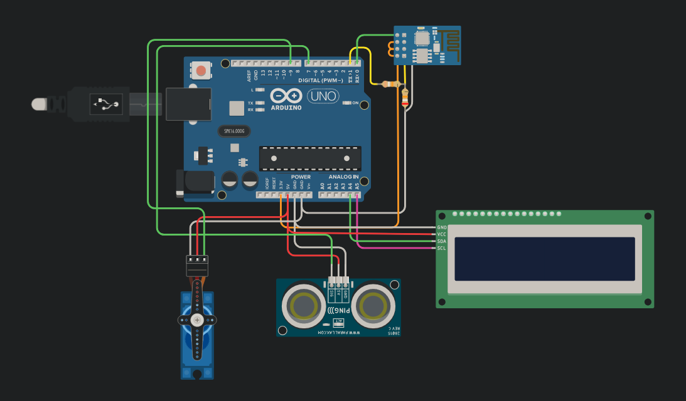

Projeto no <a href="https://www.tinkercad.com/things/2NQrVRhY0wA-projeto-esp-sensorultrassonico-servo?sharecode=WzB_VbrL4rvyUz4DGVCEvDb8TJ7duZIBXDKeq3xxInQ"> Tinkercad </a> 
Envia get request pro <a href="https://thingspeak.com/apps/thinghttp/207543">ThingHTTP</a>     
que envia post request pro <a href="https://ifttt.com/applets/mhb36VuQ-if-maker-event-door_open-then-make-a-web-request">IFTTT (If This Then That)</a> 
que por sua vez envia post request pro endereço de um server (http://172.203.236.184:80/) para mostrar o horário que um visitante se aproximou do sensor:   
